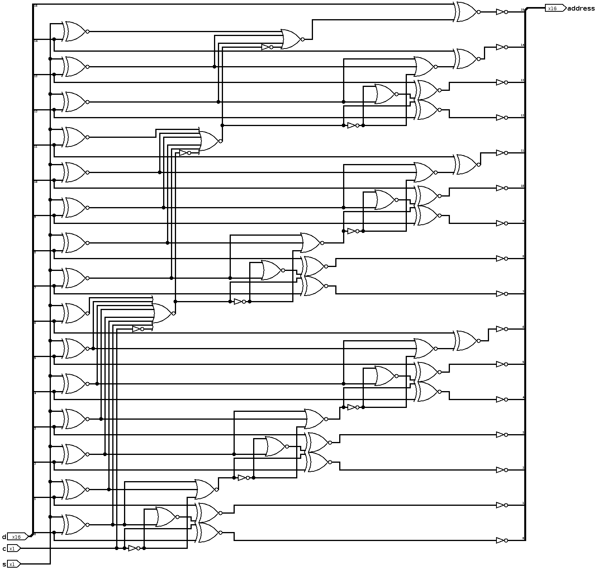

# 2022_intro_ic_hw1
### One folder per question.
### Include testbech for Q2 and Q3.

#### Q1. What is the function of Below Schematic

#### Q2. Implement above function with Verilog

#### Q3. Design a logic in verilog which mimics a infinite width register. It takes input serially 1 bit at a time.  Output is asserted high when this register holds a value which is divisible by 5.  For example:

| Input | Sequence(bin) | Value(dec) | Output |
| ----- | ------------- | ---------- | ------ |
| 1     | 1             | 1          | 0      |
| 0     | 10            | 2          | 0      |
| 1     | 101           | 5          | 1      |
| 0     | 1010          | 10         | 1      |
| 1     | 10101         | 21         | 0      |

#### Q4. Introduce Yourself

